<p align="center">
  
</p>

<h1 align="center">Pipeline PLN — Amazon Fine Food Reviews</h1>

<p align="center">
  Projeto da disciplina <strong>Sistemas Cognitivos e Linguagem Natural</strong><br />
  Pipeline completo de PLN sobre avaliações de alimentos gourmet na Amazon.
</p>

<p align="center">
  <a href="https://github.com/ubyss/pipeline-pln-amazon-reviews">Repositório</a> ·
  <a href="https://www.kaggle.com/datasets/snap/amazon-fine-food-reviews">Dataset (Kaggle)</a>
</p>

---

## Visão geral

O notebook `projeto_pln_amazon.ipynb` cobre o fluxo end-to-end: EDA, pré-processamento (NLTK + spaCy), BoW/TF-IDF, Word2Vec, busca por similaridade, LDA, classificação de sentimento e categorias, VADER, NER, grafo de conhecimento (NetworkX + PyVis) e exportação de métricas.

| Item | Valor |
|------|--------|
| Corpus | [Amazon Fine Food Reviews](https://www.kaggle.com/datasets/snap/amazon-fine-food-reviews) |
| Amostra | 10.000 reviews · ~204 palavras/doc · 8 grupos `Gourmet_Foods_G1`–`G8` |
| Idioma | Inglês |

---

## Resultados visuais

### Exploração e pré-processamento

<p align="center">
  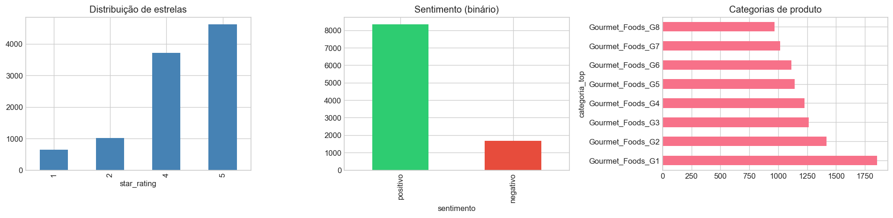
  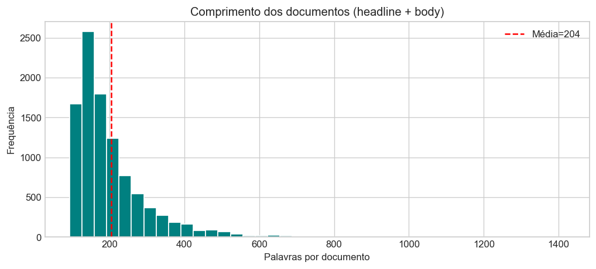
</p>

<p align="center">
  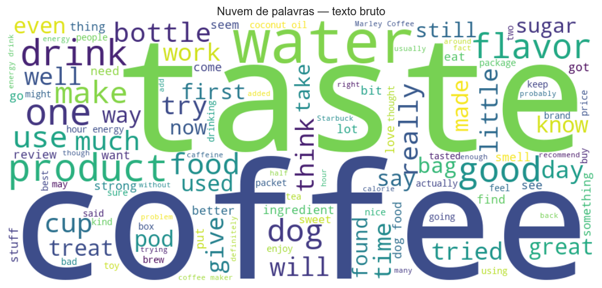
  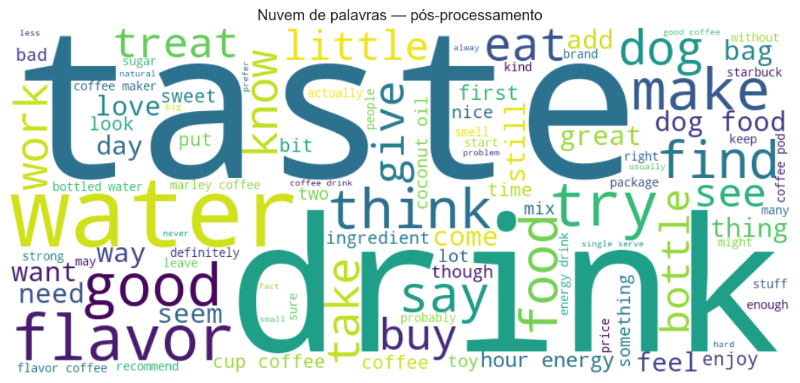
</p>

<p align="center">
  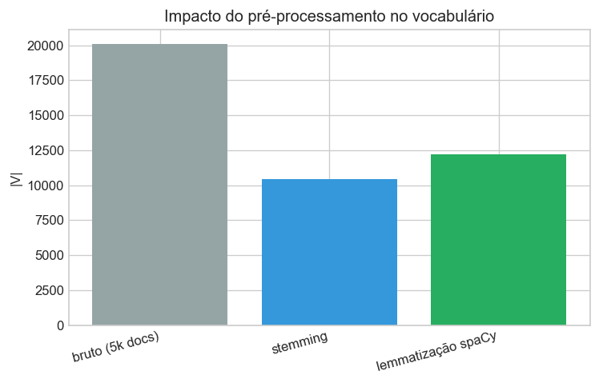
</p>

<p align="center">
  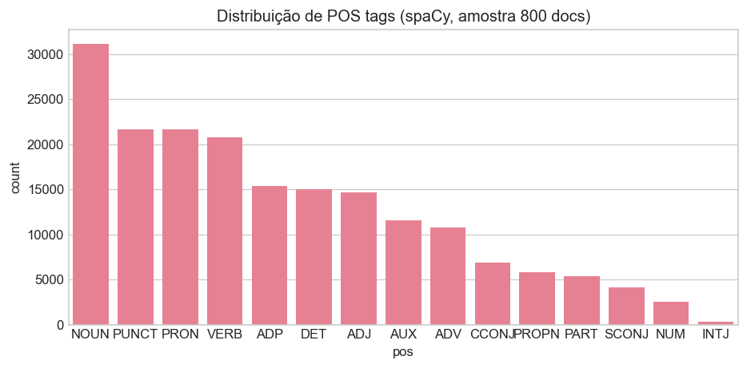
  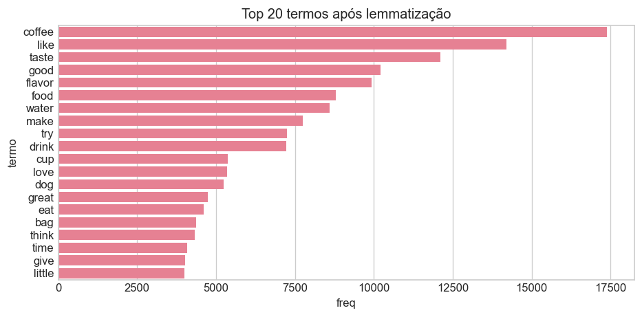
</p>

### Representação vetorial

<p align="center">
  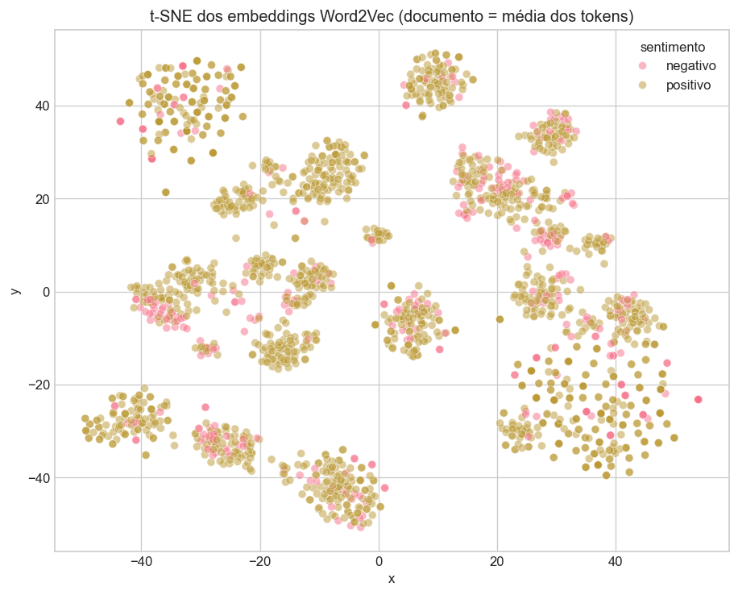
</p>

<p align="center">
  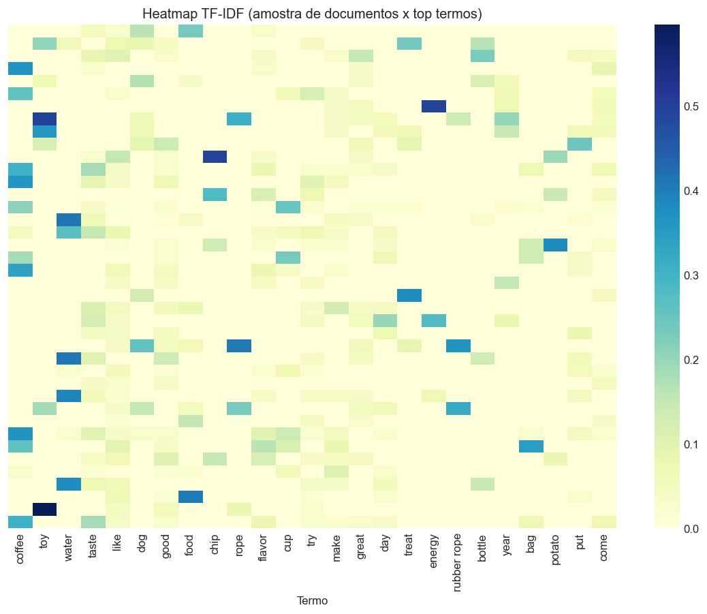
</p>

### Classificação e tópicos

<p align="center">
  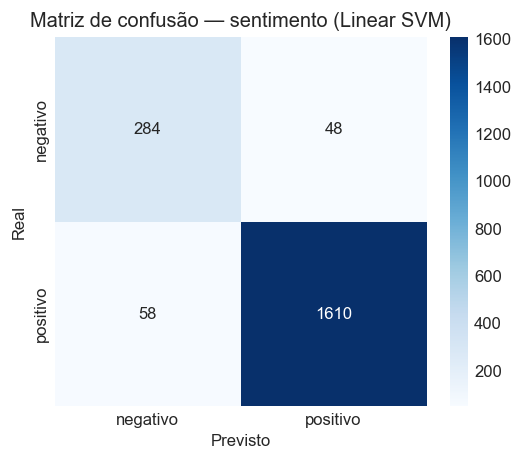
  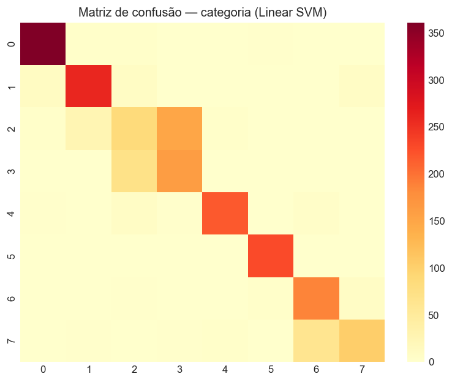
  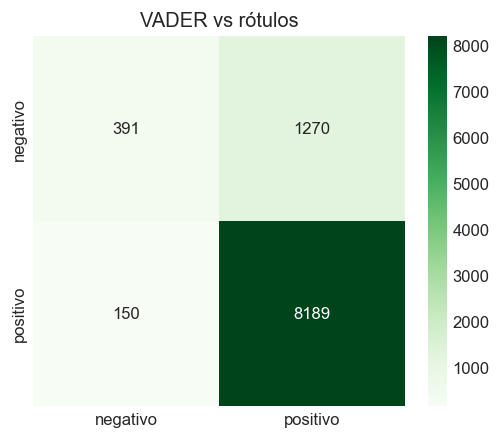
</p>

<p align="center">
  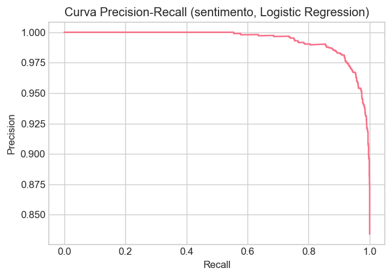
  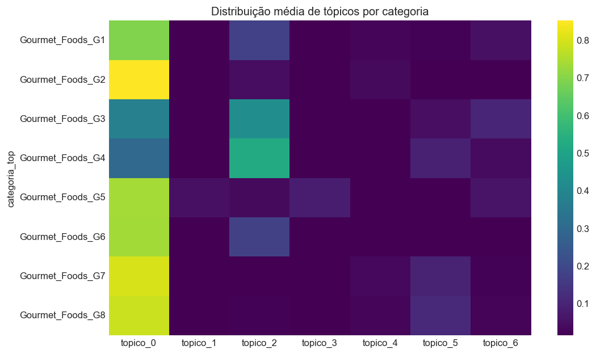
</p>

### Visualizações interativas

| Artefato | Descrição |
|----------|-----------|
| [grafo_conhecimento.html](outputs/grafo_conhecimento.html) | Grafo de marcas, categorias e coocorrências (PyVis) |
| [ldavis.html](outputs/ldavis.html) | Tópicos LDA (pyLDAvis) |
| [displacy_ner.html](outputs/displacy_ner.html) | Entidades nomeadas (spaCy displaCy) |
| [metricas_classificacao.csv](outputs/metricas_classificacao.csv) | F1, precision e recall por modelo |

---

## Estrutura do projeto

```
├── projeto_pln_amazon.ipynb
├── requirements.txt
├── assets/
│   └── logo-Infnet.png
├── data/
│   ├── raw/
│   └── sample/
│       ├── Reviews.csv              # corpus completo (~568k reviews, Git LFS)
│       └── amazon_reviews_sample.csv
├── outputs/
└── scripts/
    ├── build_sample.py
    └── generate_sample_fallback.py
```

---

## Pré-requisitos

- Python 3.10+

## Instalação

```bash
pip install -r requirements.txt
```

O notebook baixa o modelo spaCy `en_core_web_sm` e os recursos NLTK na primeira execução da célula de setup.

## Execução rápida

```bash
pip install -r requirements.txt
jupyter notebook projeto_pln_amazon.ipynb
```

Configure credenciais Kaggle (`~/.kaggle/kaggle.json` ou `KAGGLE_USERNAME` / `KAGGLE_KEY`).

Execute **Run All**:

1. Se `amazon_reviews_sample.csv` não existir, o notebook baixa [Amazon Fine Food Reviews](https://www.kaggle.com/datasets/snap/amazon-fine-food-reviews) com **kagglehub** e roda `scripts/build_sample.py`.
2. O pipeline usa a amostra de 10k reviews.

Clone com Git LFS se quiser `Reviews.csv` já no disco (opcional).

## Regenerar amostra manualmente

```bash
python scripts/build_sample.py
```

---

## Tecnologias

NLTK · spaCy · scikit-learn · Gensim · VADER · LDA/pyLDAvis · NetworkX · PyVis · Matplotlib · WordCloud

---

<p align="center">
  
</p>
